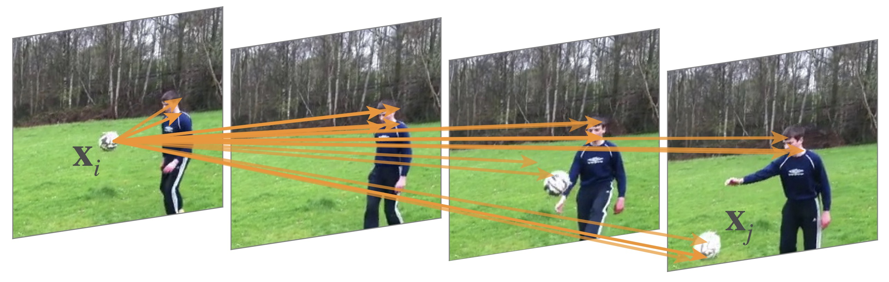

# Non-local Neural Networks for Video Classification

This code is a re-implementation of the video classification experiments in the paper [Non-local Neural Networks](https://arxiv.org/abs/1711.07971). The code is developed based on the [Caffe2](https://caffe2.ai/) framework.

<div align="center">
  
</div>

## License
The code and the models in this repo are released under the [CC-BY-NC 4.0 LICENSE](https://github.com/facebookresearch/video-nonlocal-net/blob/master/LICENSE).

## Citation
If you use our code in your research or wish to refer to the baseline results, please use the following BibTeX entry.
```
@article{NonLocal2018,
  author =   {Xiaolong Wang and Ross Girshick and Abhinav Gupta and Kaiming He},
  title =    {Non-local Neural Networks},
  journal =  {CVPR},
  year =     {2018}
}
```

## Installation
Please find installation instructions for Caffe2 in [`INSTALL.md`](INSTALL.md). We also suggest to check the [Detectron installation](https://github.com/facebookresearch/Detectron/blob/master/INSTALL.md) and its issues if you had problems.

## Pre-trained Models for Downloads

First go into the data folder:
```Shell
cd data
mkdir pretrained_model
mkdir checkpoints
```
#### ImageNet pre-trained models
They can be downloaded from: [pretrained_model.tar.gz](https://dl.fbaipublicfiles.com/video-nonlocal/pretrained_model.tar.gz). Extract the models to the current folder:
```Shell
wget https://dl.fbaipublicfiles.com/video-nonlocal/pretrained_model.tar.gz
tar xzf pretrained_model.tar.gz
```

## Dataset Preparation

Please read [`DATASET.md`](DATASET.md) for downloading and preparing the Kinetics dataset.

**Note:** In this repo, we release the model which are trained with the same data as our paper.

## Main Results
All the training scripts with ResNet-50 backbone are here:
```Shell
cd scripts
```

We report the benchmarks with ResNet-50 backbone as below. All the numbers are obtain via fully-convolutional testing. All the models and training logs are available for download (some logs might not contain the fully-convolutional testing numbers):


| <sub>script</sub> | <sub>input frames</sub> | <sub>freeze bn?</sub> | <sub>3D conv?</sub> | <sub>non-local?</sub> | <sub>top1</sub> | <sub>in paper</sub> | <sub>top5</sub> | <sub>model</sub> | <sub>logs</sub> |
| ------------- | ------------- | ------------- | ------------- | ------------- | ------------- | ------------- | ------------- | ------------- | ------------- |
| <sub>run_c2d_baseline_400k_32f.sh</sub> | 32 | - | - | - | 72.0 | <sub>71.8</sub> | 90.0 | [`link`](https://dl.fbaipublicfiles.com/video-nonlocal/c2d_baseline_32x2_IN_pretrain_400k.pkl) | [`link`](https://dl.fbaipublicfiles.com/video-nonlocal/c2d_baseline_32x2_IN_pretrain_400k.log) |
| <sub>run_c2d_nlnet_400k_32f.sh</sub> | 32 | - | - | Yes | 73.9 | <sub>73.8</sub> | 91.0 | [`link`](https://dl.fbaipublicfiles.com/video-nonlocal/c2d_nonlocal_32x2_IN_pretrain_400k.pkl) | [`link`](https://dl.fbaipublicfiles.com/video-nonlocal/c2d_nonlocal_32x2_IN_pretrain_400k.log) |
| <sub>run_i3d_baseline_400k_32f.sh</sub> | 32 | - | Yes | - | 73.6 | <sub>73.3</sub> | 90.8 | [`link`](https://dl.fbaipublicfiles.com/video-nonlocal/i3d_baseline_32x2_IN_pretrain_400k.pkl) | [`link`](https://dl.fbaipublicfiles.com/video-nonlocal/i3d_baseline_32x2_IN_pretrain_400k.log) |
| <sub>run_i3d_nlnet_400k_32f.sh</sub> | 32 | - | Yes | Yes | 74.9 | <sub>74.9</sub> | 91.6 | [`link`](https://dl.fbaipublicfiles.com/video-nonlocal/i3d_nonlocal_32x2_IN_pretrain_400k.pkl) | [`link`](https://dl.fbaipublicfiles.com/video-nonlocal/i3d_nonlocal_32x2_IN_pretrain_400k.log) |
| <sub>run_i3d_baseline_affine_400k_128f.sh</sub> | 128 | Yes | Yes | - | 75.2 | <sub>74.9</sub> | 92.0 | [`link`](https://dl.fbaipublicfiles.com/video-nonlocal/i3d_baseline_128x1_I3D_pretrain_400k.pkl) | [`link`](https://dl.fbaipublicfiles.com/video-nonlocal/i3d_baseline_128x1_I3D_pretrain_400k.log) |
| <sub>run_i3d_nlnet_affine_400k_128f.sh</sub> | 128 | Yes | Yes | Yes | 76.5 | <sub>76.5</sub> | 92.7 | [`link`](https://dl.fbaipublicfiles.com/video-nonlocal/i3d_nonlocal_128x1_I3D_pretrain_400k.pkl) | [`link`](https://dl.fbaipublicfiles.com/video-nonlocal/i3d_nonlocal_128x1_I3D_pretrain_400k.log) |

#### Modifications for improving speed

Besides releasing the models following the exact parameter settings in the paper, we ablate a few different training settings which can significantly improve training/testing speed with almost the same performance.

* **Sparser sampling of inputs**. We sample N frames with a stride of M frames (so covering N * M frames in the raw view). In the paper we used (N, M) = (32, 2) for short clips and (N, M) = (128, 1) for long clips. The following experiments use (N, M) = (8, 8) for short clips and (N, M) = (32, 4) for long clips. The temporal strides are adjusted accordingly such that the feature map sizes are unchanged in res2 to res5. This modification is to reduce data I/O, which can significantly improve the speed.


| <sub>script</sub> | <sub>input frames</sub> | <sub>freeze bn?</sub> | <sub>3D conv?</sub> | <sub>non-local?</sub> | <sub>top1</sub> | <sub>top5</sub> | <sub>model</sub> | <sub>logs</sub> |
| ------------- | ------------- | ------------- | ------------- | ------------- | ------------- | ------------- | ------------- | ------------- |
| <sub>run_c2d_baseline_400k.sh</sub> | 8 | - |  - | - | 71.9 | 90.0 | [`link`](https://dl.fbaipublicfiles.com/video-nonlocal/c2d_baseline_8x8_IN_pretrain_400k.pkl) | [`link`](https://dl.fbaipublicfiles.com/video-nonlocal/c2d_baseline_8x8_IN_pretrain_400k.log) |
| <sub>run_c2d_nlnet_400k.sh</sub> | 8 | - |  - | Yes | 74.4 | 91.4 | [`link`](https://dl.fbaipublicfiles.com/video-nonlocal/c2d_nonlocal_8x8_IN_pretrain_400k.pkl) | [`link`](https://dl.fbaipublicfiles.com/video-nonlocal/c2d_nonlocal_8x8_IN_pretrain_400k.log)|
| <sub>run_i3d_baseline_400k.sh</sub> | 8 | - |  Yes | - | 73.4 | 90.9 | [`link`](https://dl.fbaipublicfiles.com/video-nonlocal/i3d_baseline_8x8_IN_pretrain_400k.pkl) | [`link`](https://dl.fbaipublicfiles.com/video-nonlocal/i3d_baesline_8x8_IN_pretrain_400k.log) |
| <sub>run_i3d_nlnet_400k.sh</sub> | 8 | - |  Yes | Yes | 74.7 | 91.6 | [`link`](https://dl.fbaipublicfiles.com/video-nonlocal/i3d_nonlocal_8x8_IN_pretrain_400k.pkl) | [`link`](https://dl.fbaipublicfiles.com/video-nonlocal/i3d_nonlocal_8x8_IN_pretrain_400k.log) |
| <sub>run_i3d_baseline_affine_400k.sh</sub> | 32 | Yes |  Yes | - | 75.5 | 92.0 | [`link`](https://dl.fbaipublicfiles.com/video-nonlocal/i3d_baseline_32x4_I3D_pretrain_400k.pkl) | [`link`](https://dl.fbaipublicfiles.com/video-nonlocal/i3d_baseline_32x4_I3D_pretrain_400k.log) |
| <sub>run_i3d_nlnet_affine_400k.sh</sub> | 32 | Yes |  Yes | Yes | 76.5 | 92.6 | [`link`](https://dl.fbaipublicfiles.com/video-nonlocal/i3d_nonlocal_32x4_I3D_pretrain_400k.pkl) | [`link`](https://dl.fbaipublicfiles.com/video-nonlocal/i3d_nonlocal_32x4_I3D_pretrain_400k.log) |


* **Fewer training iterations**.  With sparser sampling of inputs, we further reduce the training time by reducing the training iterations. Instead of training for 400K iterations in the paper, we can train our model with 300K iterations. This reduces training epochs by 25% without losing much performance.

| <sub>script</sub> | <sub>input frames</sub> | <sub>freeze bn?</sub> | <sub>3D conv?</sub> | <sub>non-local?</sub> | <sub>top1</sub> | <sub>top5</sub> | <sub>model</sub> | <sub>logs</sub> |
| ------------- | ------------- | ------------- | ------------- | ------------- | ------------- | ------------- | ------------- | ------------- |
| <sub>run_i3d_baseline_300k.sh</sub> | 8 | - | Yes | - | 73.2 | 90.8 | [`link`](https://dl.fbaipublicfiles.com/video-nonlocal/i3d_baseline_8x8_IN_pretrain_300k.pkl) | [`link`](https://dl.fbaipublicfiles.com/video-nonlocal/i3d_baseline_8x8_IN_pretrain_300k.log) |

#### Training with fewer GPUs

* The following two models were run by Xiaolong Wang with 4-GPU (GTX 1080) machines outside of Facebook after the internship. The training data is downloaded on 12/20/2017 (see [`DATASET.md`](DATASET.md)), which misses some videos due to invalid urls. The training schedule is shorter (4-GPU 600k vs. 8-GPU 400k above). These changes lead to a slight accuracy drop.

* We also provide training scripts/models with half iterations (300K with 4 GPUs) and less regularization. This baseline is fast and for sanity check: it only takes less than 3 days training on a machine with 4 GPUs (see "run_i3d_baseline_300k_4gpu.sh").

| <sub>script</sub> | <sub>input frames</sub> | <sub>GPUs</sub> | <sub>freeze bn?</sub> | <sub>3D conv?</sub> | <sub>non-local?</sub> | <sub>top1</sub> | <sub>top5</sub> | <sub>model</sub> | <sub>logs</sub> |
| ------------- | ------------- | ------------- | ------------- | ------------- | ------------- | ------------- | ------------- | ------------- | ------------- |
| <sub>run_i3d_baseline_600k_4gpu.sh</sub> | 8 | 4 | - | Yes | -  | 73.0 | 90.4 | [`link`](https://dl.fbaipublicfiles.com/video-nonlocal/i3d_baseline_8x8_IN_pretrain_600k_4gpu.pkl) | [`link`](https://dl.fbaipublicfiles.com/video-nonlocal/i3d_baseline_8x8_IN_pretrain_600k_4gpu.log) |
| <sub>run_i3d_baseline_300k_4gpu.sh</sub> | 8 | 4 | - | Yes | -  | 72.0 | 90.1 | [`link`](https://dl.fbaipublicfiles.com/video-nonlocal/i3d_baseline_8x8_IN_pretrain_300k_4gpu.pkl) | [`link`](https://dl.fbaipublicfiles.com/video-nonlocal/i3d_baseline_8x8_IN_pretrain_300k_4gpu.log) |


#### Script details

We now explain the scripts taking the ones trained with 3D convolutions, 400k iterations, 8GPUs, and sparser inputs as examples (in [`Modifications for improving speed`](#modifications-for-improving-speed)).

1. The following script is the baseline i3d methods with ImageNet pre-trained network:
    ```Shell
    run_i3d_baseline_400k.sh
    ```

2. The following script trains the i3d model with 5 Non-local layers with ImageNet pre-trained network:
    ```Shell
    run_i3d_nlnet_400k.sh
    ```

3. To train the i3d Non-local Networks with longer clips (32-frame input), we first need to obtain the model trained from "run_i3d_baseline_400k.sh" as a pre-trained model. Then we convert the Batch Normalization layers into Affine layers by running:
    ```Shell
    cd ../process_data/convert_models
    python modify_caffe2_ftvideo.py ../../data/checkpoints/run_i3d_baseline_400k/checkpoints/c2_model_iter400000.pkl  ../../data/pretrained_model/run_i3d_baseline_400k/affine_model_400k.pkl
    ```

    Note that we have provided one example model (run_i3d_baseline_400k/affine_model_400k.pkl) in [pretrained_model.tar.gz](https://dl.fbaipublicfiles.com/video-nonlocal/pretrained_model.tar.gz). Given this converted model, we run the script for training the i3d Non-local Networks with longer clips:
    ```Shell
    run_i3d_nlnet_affine_400k.sh
    ```

4. The models with ResNet-101 backbone can be trained by setting:
    ```Shell
    TRAIN.PARAMS_FILE ../data/pretrained_model/r101_pretrain_c2_model_iter450450_clean.pkl
    MODEL.DEPTH 101
    MODEL.VIDEO_ARC_CHOICE 4 # 3 for c2d, and 4 for i3d
    ```

## Testing

The models are tested immediately after training. For each video, we sample 10 clips along the temporal dimension as in the paper. For each video clip, we resize the shorter side to 256 pixels and use 3 crops to cover the entire spatial size. We use fully-convolutional testing on each of the 256x256 crops. This is a slower approximation of the fully convolutional testing (on the variable full size, e.g., 256x320) done in the paper, which requires specific implementation not provided in this repo.

Taking the model trained with "run_i3d_nlnet_400k.sh" as an example, we can run testing by specifying:
```Shell
TEST.TEST_FULLY_CONV True
```
as in the script:
```Shell
run_test_multicrop.sh
```

## Fine-tuning

The fine-tuning process is almost exactly the same as the training process. The only difference is that you need to first modify our Kinectis pre-trained model by removing the iteration number, momentum and last layer parameters, which is done with
```Shell
process_data/convert_models/modify_blob_rm.py
```

## Acknowledgement

The authors would like to thank [Haoqi Fan](https://research.fb.com/people/fan-haoqi/) for training the models and re-producing the results at FAIR with this code.
